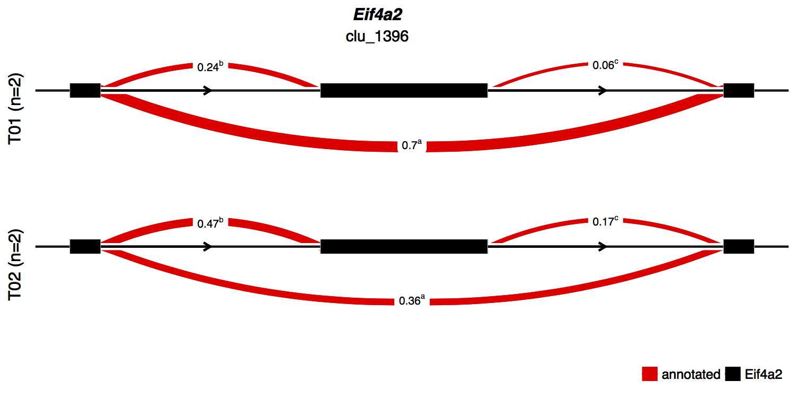

```{r setup, include=FALSE}
knitr::opts_chunk$set(echo = TRUE,
                      tidy = FALSE,
                      warning = FALSE,
                      message = FALSE)
```


# Introduction

GeneStructureTools is a package for the manipulation and analysis of transcribed gene structures.

We have provided functions for importing Whippet and leafcutter alternative splicing data, and the analysis of these splicing events. 
Splicing events can also be defined manually if you are using a different splicing analysis tool to Whippet.
For specific events - currently including exon skipping, intron retention, alternative splice site usage and alternative first/last exons - transcripts can be made in silico which use the two splicing modes - i.e. transcripts containing and transcripts skipping an exon. 
These transcripts do not have to be pre-annotated, and thus all potential isoforms can be compared for an event.

Current comparisons of transcripts include annotating and analysing ORF and UTR features (length, locations, difference/similarity between transcripts), and predicting nonsense mediated decay (NMD) potential.

We also have functions for re-annotation of .GTF features, such as annotating UTRs as 3' or 5', and assigning a broader biotype for genes and transcripts so more informative analysis can be performed between these classes. 

# Importing Differential Splicing Data

Currently, very few available tools output splicing event type information (i.e. exon skipping, intron retention) within tested genes.
GeneStructureTools currently has functions for processing data from:

[**whippet**](https://github.com/timbitz/Whippet.jl)

[**DEXSeq**](http://bioconductor.org/packages/release/bioc/html/DEXSeq.html)

[**leafcutter**](https://github.com/davidaknowles/leafcutter)

**Data Preparation**

We have pre-prepared data from mouse embryonic stem cell (ESC) development (Gloss et. al, 2017, Accession Number [GSE75028](https://www.ebi.ac.uk/ena/data/view/PRJNA302257)), at days 0 and 5, and run whippet on each replicate using the reccomended parameters and the Gencode vM14 annotation.
You can download the whippet, leafcutter, and DEXSeq files [here](https://drive.google.com/open?id=0BxH-QCp3c0OVZXpQMDNFVUlwWDA).

You will also need to download the Gencode GTF file from [here](http://www.gencodegenes.org/mouse_releases/14.html).

For the purposes of this vignette, small subsets of these data are available in the package data (inst/extdata).

Data provided is typical output for leafcutter and Whippet. For details on what each file contains, please refer to their respective manuals ( [leafcutter](http://davidaknowles.github.io/leafcutter/index.html) | [Whippet](https://github.com/timbitz/Whippet.jl) ).

DEXSeq data is processed as reccomended by the (DEXSeq) manual. The script used to process raw output is [here](https://github.com/betsig/GeneStructureTools/blob/master/inst/extdata/dexseq_process.R)

## Whippet

To run a full analysis on Whippet output, you will need the raw .psi.gz (percent spliced in) and .jnc.gz (junction read counts) files for each sample. In addition, you will need to compare conditions using `whippet-delta.jl` and have a resulting .diff.gz file.

**Read in Whippet files from downloaded data**

```{r readWhippetWholeData, eval = FALSE}
# Load packages
library(GeneStructureTools)
library(GenomicRanges)
library(stringr)
library(BSgenome.Mmusculus.UCSC.mm10)
library(Gviz)
library(rtracklayer)


# list of files in the whippet directory
whippet_file_directory <- "~/Downloads/GeneStructureTools_VignetteFiles/"

# read in files as a whippetDataSet
wds <- readWhippetDataSet(whippet_file_directory)

# create a sample table with sample id, condition and replicate
whippet_sampleTable <- data.frame(sample=c("A01","B01","A21","B21"),
                                  condition=c("01","01","21","21"),
                                  replicate=(c("A","B","A","B")))
                                  
# read in gtf annotation
gtf <- rtracklayer::import("~/Downloads/gencode.vM14.annotation.gtf.gz")
exons <- gtf[gtf$type=="exon"]
transcripts <- gtf[gtf$type=="transcript"]

# add first/last annotation (speeds up later steps)
if(!("first_last" %in% colnames(mcols(exons)))){
    t <- as.data.frame(table(exons$transcript_id))
    exons$first_last <- NA
    exons$first_last[exons$exon_number == 1] <- "first"
    exons$first_last[exons$exon_number == 
    t$Freq[match(exons$transcript_id, t$Var1)]] <- "last"
}

# specify the BSGenome annotation
g <- BSgenome.Mmusculus.UCSC.mm10::BSgenome.Mmusculus.UCSC.mm10

```

**Read in Whippet files from package data**

```{r readWhippet}
# Load packages
suppressPackageStartupMessages({
library(GeneStructureTools)
library(GenomicRanges)
library(stringr)
library(BSgenome.Mmusculus.UCSC.mm10)
library(Gviz)
library(rtracklayer)
})
# list of files in the whippet directory
whippet_file_directory <- system.file("extdata","whippet/", 
package = "GeneStructureTools")

# read in files as a whippetDataSet
wds <- readWhippetDataSet(whippet_file_directory)

# create a sample table with sample id, condition and replicate
whippet_sampleTable <- data.frame(sample=c("A01","B01","A21","B21"),
                                  condition=c("01","01","21","21"),
                                  replicate=(c("A","B","A","B")))

# read in gtf annotation
gtf <- rtracklayer::import(system.file("extdata","example_gtf.gtf", 
package = "GeneStructureTools"))
exons <- gtf[gtf$type=="exon"]
transcripts <- gtf[gtf$type=="transcript"]

# add first/last annotation (speeds up later steps)
if(!("first_last" %in% colnames(mcols(exons)))){
    t <- as.data.frame(table(exons$transcript_id))
    exons$first_last <- NA
    exons$first_last[exons$exon_number == 1] <- "first"
    exons$first_last[exons$exon_number == 
    t$Freq[match(exons$transcript_id, t$Var1)]] <- "last"
}

# specify the BSGenome annotation
g <- BSgenome.Mmusculus.UCSC.mm10::BSgenome.Mmusculus.UCSC.mm10

```

## leafcutter

Only the file containg the leafcutter results for each intron, and the .gtf file used with leafcutter needs to be read in for results processing. The leafcutter results file is generated after running [prepare_results.R](https://github.com/davidaknowles/leafcutter/blob/master/leafviz/prepare_results.R) on your data, then extracting out the intron data table.

First, find the location of the leafviz2table.R script:
```{r, findScript, eval=FALSE}
#find location of the script
system.file("extdata","leafviz2table.R", package = "GeneStructureTools")
```
Then run it on your leafviz output .RData file.
The first argument is the leafviz output RData file, and the second is the name of the table you wish to write the intron results to.
```{sh, eval=FALSE}
Rscript leafviz2table.R leafviz.RData per_intron_results.tab
```

We have an processed example file available in `extdata/GeneStructureTools` with a small sample of significant events.

```{r readLeafcutter}
# read in gtf annotation
gtf <- rtracklayer::import(system.file("extdata","example_gtf.gtf", package = "GeneStructureTools"))
exons <- gtf[gtf$type=="exon"]

# specify the BSGenome annotation
g <- BSgenome.Mmusculus.UCSC.mm10::BSgenome.Mmusculus.UCSC.mm10

# list of files in the leafcutter directory
leafcutter_files <- list.files(system.file("extdata","leafcutter/", package = "GeneStructureTools"),full.names = TRUE)

intron_results <- read.delim(leafcutter_files[grep("per_intron_results.tab", leafcutter_files)], stringsAsFactors = FALSE)

```


# Summarise changes in gene structures due to splicing
## Whippet
```{r filterWhippetEvents}
# filter events for significance
wds <- filterWhippetEvents(
whippetDataSet = wds,
probability = 0.95, # min probability
psiDelta = 0.1, # min change in PSI
eventTypes = "all", # all event types
minCounts = 100, # mean of at least 100 counts in one condition
sampleTable = whippet_sampleTable)

# check for changes in gene/transcript structure
whippet_summary <- whippetTranscriptChangeSummary(wds,
exons = exons,
transcripts = transcripts,
BSgenome = g,
NMD = FALSE # ignore nonsense mediated decay
)
head(whippet_summary)

```

### leafcutter
```{r leafcutterSummary}
leafcutter_summary <- leafcutterTranscriptChangeSummary(intron_results, 
                                                        exons = exons,
                                                        BSgenome = g,
                                                        NMD = FALSE,
                                                        showProgressBar = FALSE)

head(leafcutter_summary[!duplicated(leafcutter_summary$cluster),])
```


# Altering Gene and Transcript Structures
whippetTranscriptChangeSummary() combines several functions for analysing changes in gene structures. While this has been made to simplify analysis from whippet data, individual functions can be used on other data sources or manually annotated gene structures.
It may also be helpful to run each individual step if you would like to manually investigate changes to genes.

## Exon skipping
Exon skipping, or cassette exon usage, occurs when a single exon is spliced out of the mature transcript.


**1.a. Find skipped exon events**
```{r whippetSkippedFilter}
# filter out skipped exon events (coded as "CE")
# we will be looking at Ndufv3 (ENSMUSG00000024038.16)
wds.ce <- filterWhippetEvents(wds, psiDelta=0,probability=0, 
event="CE", idList="ENSMUSG00000024038.16")

diffSplicingResults(wds.ce)
# psi_a = 0.137, psi_b = 0.275
# percentage of transcripts skipping exon 3 decreases from timepoint 1 to 21

# whippet outputs the skipped exon coordinates
coordinates(wds.ce)

```

**2. Find transcripts which overlap the skipped exon, and create normal & skipped exon isoforms**
```{r findOverlapsSkipped}
# find exons in the gtf that overlap the skipped exon event
exons.ce <- findExonContainingTranscripts(wds.ce, 
                                          exons = exons,
                                          transcripts = transcripts)
# make skipped and included exon transcripts
# removes the skipped exon from all transcripts which contain it
skippedExonTranscripts <- skipExonInTranscript(skippedExons = exons.ce,
                                               exons=exons, 
                                               match="skip",
                                               whippetDataSet = wds.ce)
```


```{r skippedGviz, eval=TRUE}
## make Gvis models
# set up for visualisation
gtr <- GenomeAxisTrack()

# all transcripts for the gene
geneModel.all <- GeneRegionTrack(makeGeneModel(exons[exons$gene_id ==
skippedExonTranscripts$gene_id[1]]),
                                 name="Reference Gene",
                                 showId=TRUE,
                                 transcriptAnnotation = "transcript")
# reference transcript
geneModelNormal <- GeneRegionTrack(makeGeneModel(
skippedExonTranscripts[skippedExonTranscripts$set=="included_exon"]),
                                   name="Reference Isoform",
                                   showId=TRUE, fill="#4D7ABE",
                                   transcriptAnnotation = "transcript")
# for the skipped exon transcript
geneModelSkipped <- GeneRegionTrack(makeGeneModel(
skippedExonTranscripts[skippedExonTranscripts$set=="skipped_exon"]),
                                   name="Alternative Isoform",
                                   showId=TRUE, fill="#94AFD8",
                                   transcriptAnnotation = "transcript")

plotTracks(list(gtr,geneModel.all,geneModelNormal, geneModelSkipped), 
extend.left = 1000, extend.right = 1000)
# Only the transcript isoform containing the skipped exon (exon 3) 
# is used for analysis, and a 'novel' isoform is created by exon skipping

```


## Intron Retention
Intron Retention occurs when an intron is not spliced out of the mature transcript.


**1. Create normal and retained isoform structures from whippet coordinates**
```{r retainedIntronWhippet}
# filter out retained events (coded as "RI")
# we will be looking at Srsf1 (ENSMUSG00000018379.17)
wds.ri <- filterWhippetEvents(wds, psiDelta=0,probability=0, 
event="RI", idList="ENSMUSG00000018379.17")

diffSplicingResults(wds.ri)

```


**2. Find transcripts which overlap the intron, and create normal & retained intron isoforms**
```{r findIntron}
# find exons pairs in the gtf that bound the retained intron event
exons.ri <- findIntronContainingTranscripts(wds.ri, 
                                            exons)

# make retained and non-retained transcripts
# adds the intron into all transcripts which overlap it
retainedIntronTranscripts <- addIntronInTranscript(exons.ri, 
                                                   exons = exons, 
                                                   whippetDataSet = wds.ri,
                                                   glueExons = TRUE)

```

```{r gvizIntronRetention, eval=TRUE}
## make Gviz models
# all transcripts for the gene
geneModel.all <- GeneRegionTrack(makeGeneModel(exons[exons$gene_id == retainedIntronTranscripts$gene_id[1]]),
                                 name="Reference Gene",
                                 showId=TRUE,
                                 transcriptAnnotation = "transcript")
# reference transcript
geneModelNormal <- GeneRegionTrack(makeGeneModel(
retainedIntronTranscripts[retainedIntronTranscripts$set=="spliced_intron"]),
                                   name="Reference Isoform",
                                   showId=TRUE, fill="#4D7ABE",
                                   transcriptAnnotation = "transcript")
# for the retained intron transcript
geneModelRetained <- GeneRegionTrack(makeGeneModel(
retainedIntronTranscripts[retainedIntronTranscripts$set=="retained_intron"]),
                                   name="Alternative Isoform",
                                   showId=TRUE, fill="#94AFD8",
                                   transcriptAnnotation = "transcript")

# Only the transcript isoforms with exons at the boundries of the retained intron are used for analysis, and 'novel' isoforms are created by intron retention
plotTracks(list(gtr,geneModel.all,geneModelNormal, geneModelRetained), 
extend.left = 1000, extend.right = 1000)
```


## Alternative acceptor and donor splice sites
Creation of alternative donor/acceptor isoforms currently relies on junction read counts supplied by whippet.


### Aternative acceptor

**1. Create normal and alternative isoform structures from whippet coordinates**
```{r altAccept}
# filter out alternative acceptor events (coded as "AA")
wds.aa <- filterWhippetEvents(wds, psiDelta=0,probability=0, 
event="AA", idList="ENSMUSG00000034064.14")

diffSplicingResults(wds.aa)

# AA/AD coordinates range from the normal acceptor splice site to the alternative acceptor splice site
coordinates(wds.aa)
```


```{r findJunctionsAA}
# find exons pairs in the gtf that bound the retained intron event
junctionPairs.aa <- findJunctionPairs(wds.aa, 
                                   type="AA")
junctionPairs.aa
```

```{r replaceJunctionAA}
# make transcripts with alternative junction usage
altTranscripts <- replaceJunction(wds.aa, 
                                  junctionPairs.aa, 
                                  exons, 
                                  type="AA")

# make transcripts using junction X
xTranscripts <- altTranscripts[altTranscripts$set=="AA_X"]
# make transcripts using junction Y
yTranscripts <- altTranscripts[altTranscripts$set=="AA_Y"]
```

```{r altAceGvis}
geneModel.all <- GeneRegionTrack(makeGeneModel(exons[exons$gene_id == altTranscripts$gene_id[1]]),
                                 name="Reference Gene",
                                 showId=TRUE,
                                 transcriptAnnotation = "transcript")
# transcript X
geneModelX <- GeneRegionTrack(makeGeneModel(xTranscripts),
                                   name="Isoform X",
                                   showId=TRUE, fill="#4D7ABE",
                                   transcriptAnnotation = "transcript")
# transcript Y
geneModelY<- GeneRegionTrack(makeGeneModel(yTranscripts),
                                   name="Isoform Y",
                                   showId=TRUE, fill="#94AFD8",
                                   transcriptAnnotation = "transcript")

plotTracks(list(gtr,geneModel.all,geneModelX, geneModelY), 
extend.left = 1000, extend.right = 1000)

# Zoomed in at the alternative acceptor site
plotTracks(list(gtr,geneModel.all,geneModelX, geneModelY), 
from = 38547500, to = 38551000)

```

### Aternative donor

**1. Create normal and alternative isoform structures from whippet coordinates**
```{r altDonor}
# filter out alternative acceptor events (coded as "AD")
# we will be looking at Mdbd3 (ENSMUSG00000035478.14)
wds.ad <- filterWhippetEvents(wds, psiDelta=0,probability=0, 
event="AD", idList="ENSMUSG00000035478.14")

diffSplicingResults(wds.ad)
# AD coordinates range from the normal donor splice site to the alternative donor splice site
coordinates(wds.ad)
```


```{r createIsoformsAD}
# find exons pairs in the gtf that bound the retained intron event
junctionPairs.ad <- findJunctionPairs(wds.ad, type="AD")

# make transcripts with alternative junction usage
altTranscripts <- replaceJunction(wds.ad, 
                                  junctionPairs.ad, 
                                  exons, type="AD")

# make transcripts using junction X
xTranscripts <- altTranscripts[altTranscripts$set=="AD_X"]
# make transcripts using junction Y
yTranscripts <- altTranscripts[altTranscripts$set=="AD_Y"]
```

```{r altDonGvis}
geneModel.all <- GeneRegionTrack(makeGeneModel(exons[exons$gene_id == altTranscripts$gene_id[1]]),
                                 name="Reference Gene",
                                 showId=TRUE,
                                 transcriptAnnotation = "transcript")
# transcript X
geneModelX <- GeneRegionTrack(makeGeneModel(xTranscripts),
                                   name="Isoform X",
                                   showId=TRUE, fill="#4D7ABE",
                                   transcriptAnnotation = "transcript")
# transcript Y
geneModelY<- GeneRegionTrack(makeGeneModel(yTranscripts),
                                   name="Isoform Y",
                                   showId=TRUE, fill="#94AFD8",
                                   transcriptAnnotation = "transcript")

plotTracks(list(gtr,geneModel.all,geneModelX, geneModelY), 
extend.left = 1000, extend.right = 1000)

```


## Alternative first/last exons
Creation of alternative first/last isoforms currently relies on junction read counts supplied by whippet.


### Alternative first exons

**1. Create normal and alternative isoform structures from whippet coordinates**
```{r altFirst}
# filter out alternative acceptor events (coded as "AF")
# we will be looking at Csrp1 (ENSMUSG00000026421.14)
wds.af <- filterWhippetEvents(wds, psiDelta=0,probability=0, 
event="AF", idList="ENSMUSG00000026421.14")

diffSplicingResults(wds.af)

# whippet outputs first (or last) exon being tested only
# AF/AL coordinates range are exon coordinates for the tested first/last exon
coordinates(wds.af)
```


```{r createIsoformsAF}
# find junction pairs that use the same acceptor/donor as the specified first/last exon
# i.e. find the alternative first/last exon
junctionPairs.af <- findJunctionPairs(wds.af, type="AF")
```


```{r replaceJunctionAF}
# make transcripts with alternative junction usage
altTranscripts <- replaceJunction(wds.af, junctionPairs.af, 
                                  exons,
                                  type="AF")

# make transcripts using exon X
xTranscripts <- altTranscripts[altTranscripts$set=="AF_X"]
# make transcripts using exon Y
yTranscripts <- altTranscripts[altTranscripts$set=="AF_Y"]
```

```{r altFirstGvis}
geneModel.all <- GeneRegionTrack(makeGeneModel(exons[exons$gene_id == altTranscripts$gene_id[1]]),
                                 name="Reference Gene",
                                 showId=TRUE,
                                 transcriptAnnotation = "transcript")
# reference transcript
geneModelX <- GeneRegionTrack(makeGeneModel(xTranscripts),
                                   name="Isoform X",
                                   showId=TRUE, fill="#4D7ABE",
                                   transcriptAnnotation = "transcript")
# for the retained intron transcript
geneModelY<- GeneRegionTrack(makeGeneModel(yTranscripts),
                                   name="Isoform Y",
                                   showId=TRUE, fill="#94AFD8",
                                   transcriptAnnotation = "transcript")

# Only the transcript isoforms with exons at the boundries of the retained intron are used for analysis, and 'novel' isoforms are created by intron retention
plotTracks(list(gtr,geneModel.all,geneModelX, geneModelY), 
extend.left = 1000, extend.right = 1000)
```

### Alternative last exons

**1. Create normal and alternative isoform structures from whippet coordinates**
```{r altLast}
# filter out alternative acceptor events (coded as "AL")
# we will be looking at Ppm1b (ENSMUSG00000061130.12)
wds.al <- filterWhippetEvents(wds, psiDelta=0,probability=0, 
event="AL", idList="ENSMUSG00000061130.12")

diffSplicingResults(wds.al)

# whippet outputs first (or last) exon being tested only
# AF/AL coordinates range are exon coordinates for the tested first/last exon
coordinates(wds.al)
```


```{r createIsoformsAL}
# find junction pairs that use the same acceptor/donor as the specified first/last exon
# i.e. find the alternative first/last exon
junctionPairs.al <- findJunctionPairs(wds.al, type="AL")

# make transcripts with alternative junction usage
altTranscripts <- replaceJunction(wds.al, junctionPairs.al, 
                                  exons, 
                                  type="AL")

# make transcripts using junction X
xTranscripts <- altTranscripts[altTranscripts$set=="AL_X"]
# make transcripts using junction Y
yTranscripts <- altTranscripts[altTranscripts$set=="AL_Y"]
```

```{r altLastGvis}
geneModel.all <- GeneRegionTrack(makeGeneModel(exons[exons$gene_id == altTranscripts$gene_id[1]]),
                                 name="Reference Gene",
                                 showId=TRUE,
                                 transcriptAnnotation = "transcript")
# reference transcript
geneModelX <- GeneRegionTrack(makeGeneModel(xTranscripts),
                                   name="Isoform X",
                                   showId=TRUE, fill="#4D7ABE",
                                   transcriptAnnotation = "transcript")
# for the retained intron transcript
geneModelY<- GeneRegionTrack(makeGeneModel(yTranscripts),
                                   name="Isoform Y",
                                   showId=TRUE, fill="#94AFD8",
                                   transcriptAnnotation = "transcript")

# Only the transcript isoforms with exons at the boundries of the retained intron are used for analysis, and 'novel' isoforms are created by intron retention
plotTracks(list(gtr,geneModel.all,geneModelX, geneModelY), 
extend.left = 1000, extend.right = 1000)
```

## Alternative Intron usage (leafcutter)
leafcutter uses an intron-centric view of splicing, and therefore all tested events are given as intron coordinates in clusters. Alternative isoforms are generated in sets. If possible, all downregulated introns/junctions are grouped together in a set, and all upregulated introns/junctions in another. 

alternativeIntronUsage() first finds transcripts which overlap each intron set, and have perfect matches to the start and end of the intron (i.e. share splice sites). If exons are present within the range overlapping the intron set, these are replaced with exons that preserve the intron usage set.

**Three intron cluster**



```{r leafcutterEif4a2}
# select a single cluster
cluster <- leafcutter_summary[leafcutter_summary$cluster=="chr16:clu_1396",]

# generate alternative isoforms
altIsoforms1396 <- alternativeIntronUsage(cluster, exons)
# downregulated isoforms
altIsoforms1396_dnreg <- altIsoforms1396[grep("dnre", 
                                            altIsoforms1396$transcript_id)]
# upregulated isoforms
altIsoforms1396_upreg <- altIsoforms1396[grep("upre", 
                                            altIsoforms1396$transcript_id)]

# visualise
gtr <- GenomeAxisTrack()

geneModel.ref <- GeneRegionTrack(makeGeneModel(
exons[exons$gene_id=="ENSMUSG00000022884.14"]),
                                    name="Reference Gene",
                                    showId=TRUE,
                                    transcriptAnnotation = "transcript")

geneModel.dnreg <- GeneRegionTrack(makeGeneModel(altIsoforms1396_dnreg),
                                    name="Downregulated isoforms",
                                    showId=TRUE,fill="#4D7ABE",
                                   transcriptAnnotation = "transcript")

geneModel.upreg <- GeneRegionTrack(makeGeneModel(altIsoforms1396_upreg),
                                name="Upregulated isoforms",fill="#94AFD8",
                                showId=TRUE,
                                transcriptAnnotation = "transcript")

plotTracks(list(geneModel.ref,geneModel.dnreg, geneModel.upreg), 
extend.left = 1000, extend.right = 1000)

```
**Five intron cluster**
More sets may be used if the number of introns in each cluster is greater than three.
In this case, the downregulated introns can overlap, so are split into two sets: e+d+b, and c


```{r leafcutterRnps1}
# select a single cluster
cluster <- leafcutter_summary[leafcutter_summary$cluster=="chr17:clu_1281",]

# generate alternative isoforms
altIsoforms1281 <- alternativeIntronUsage(cluster, exons)

# downregulated isoforms
altIsoforms1281_dnreg <- altIsoforms1281[grep("dnre", 
                                            altIsoforms1281$transcript_id)]
# upregulated isoforms
altIsoforms1281_upreg <- altIsoforms1281[grep("upre", 
                                            altIsoforms1281$transcript_id)]

# visualise
gtr <- GenomeAxisTrack()

geneModel.ref <- GeneRegionTrack(makeGeneModel(
exons[exons$gene_id=="ENSMUSG00000034681.16"]),
                                    name="Reference Gene",
                                    showId=TRUE,
                                    transcriptAnnotation = "transcript")

geneModel.dnreg <- GeneRegionTrack(makeGeneModel(altIsoforms1281_dnreg),
                                    name="Downregulated isoforms",
                                    showId=TRUE,fill="#4D7ABE",
                                   transcriptAnnotation = "transcript")

geneModel.upreg <- GeneRegionTrack(makeGeneModel(altIsoforms1281_upreg),
                                name="Upregulated isoforms",fill="#94AFD8",
                                showId=TRUE,
                                transcriptAnnotation = "transcript")

plotTracks(list(geneModel.ref,geneModel.dnreg, geneModel.upreg), 
extend.left = 1000, extend.right = 1000)

```

# Annotate Open Reading Frames

**1. Find open reading frame features**
```{r, SkippedExonORF}
# we will be looking at Ndufv3 (ENSMUSG00000024038.16) again
wds.ce <- filterWhippetEvents(wds, psiDelta=0,probability=0, 
event="CE", idList="ENSMUSG00000024038.16")

# find exons in the gtf that overlap the skipped exon event
exons.ce <- findExonContainingTranscripts(wds.ce, 
                                          exons = exons,
                                          transcripts = transcripts)
# make skipped and included exon transcripts
# removes the skipped exon from all transcripts which contain it
skippedExonTranscripts <- skipExonInTranscript(skippedExons = exons.ce,
                                               exons=exons, 
                                               match="exact",
                                               whippetDataSet=wds.ce)
# make non-skipped exon transcripts
normalTranscripts <- exons[exons$transcript_id %in% 
                                        exons.ce$transcript_id]

# get ORF details for each set of transcripts
orfs_normal <- getOrfs(normalTranscripts, BSgenome = g, 
                       returnLongestOnly = FALSE, allFrames = TRUE)
orfs_skipped <- getOrfs(skippedExonTranscripts[skippedExonTranscripts$set == 
                                                                "skipped_exon"],
                        BSgenome = g,
                        returnLongestOnly = FALSE, allFrames = TRUE)
orfs_included <- getOrfs(skippedExonTranscripts[skippedExonTranscripts$set == 
                                                               "included_exon"],
                         BSgenome = g,
                        returnLongestOnly = FALSE, allFrames = TRUE)
head(orfs_normal[,-8])
# id: transcript isoform id
# gene_id: gene id
# frame: which open reading frame (1:3)
# seq_length: sequence length (in AA)
# seq_length_nt: sequence length (in nt)
# start_site: ORF start site (in AA)
# stop_site: ORF stop site (in AA)
# orf_sequence: ORF sequence (not shown)
# orf_length: ORF length (in AA)
# start_site_nt:  ORF start site (in nt) / 5'UTR length
# stop_site_nt:  ORF stop site (in nt)
# utr3_length: 3'UTR length (in nt)
# min_dist_to_junction_a: distance from stop codon to upstream junction (junction A) 
# exon_a_from_start: junction A exon number
# min_dist_to_junction_b: distance from stop codon to downstream junction (junction B), 
# exon_b_from_final: junction B exon number (counting backwards from the final exon)
```

We can also annotate upstream open reading frames for transcripts
```{r, upstreamORFs}
# either as an indivudual data.frame with all uORFs
upstreamORFs <- getUOrfs(normalTranscripts, BSgenome = g, orfs=orfs_normal, findExonB=TRUE)

head(upstreamORFs)
# id: transcript id
# frame: reading frame for ORIGINAL orf data
# overlaps_main_orf: is the entire uorf upstream of the main orf (upstream), or is there  some overlap with the main orf (downsteam) - i.e. uORF stop codon is within the main ORF
# uorf_length: length of the uorf (in AA)
# start_site_nt: position (in nt) where the uorf start codon occurs within the transcript
# stop_site_nt: position (in nt) where the uorf stop codon occurs within the transcript
# dist_to_start_nt: distance (in nt) from the uorf stop codon to the main orf start codon
# min_dist_to_junction_b: distance from the uorf stop codon to the nearest downstream exon end/splice junction
# exon_b_from_final: relative exon number (from the end) of the uorf stop codon containing exon

# or as a summary by using the getOrfs() function
# with uORFS=TRUE
orfs_normal <- getOrfs(normalTranscripts, BSgenome = g, 
                       returnLongestOnly = FALSE, allFrames = TRUE,
                       uORFs=TRUE)

head(orfs_normal[,-8])
# this adds the following columns:
# total_uorfs: total number of uorfs found for the transcript and annotated open reading frame.
# upstream_count: number of uorfs that are located fully upstream of the main orf
# downstream_count: number of uorfs which partially overlap the main orf
# max_uorf: maximum length of an annotated uorf. If no uorfs annotated, = 0
# uorf_maxb: maximum distance from the uorf stop codon to the nearest downstream exon end/splice junction

```

**2. Compare ORFs**
```{r CompareORF}
# compare normal and skipped isoforms
orfChange <- orfDiff(orfsX = orfs_included, 
                     orfsY = orfs_skipped, 
                     filterNMD = FALSE,
                     compareBy="gene",
                     geneSimilarity = TRUE,
                     compareUTR=TRUE,
                     allORFs = orfs_normal)

orfChange
# id: splicing event ID
# orf_length_by_group_x: longest orf in first set of transcripts (included exon)
# orf_length_by_group_y: longest orf in second set of transcripts (skipped exon)
# utr3_length_by_group_x: 3'UTR length in first set of transcripts (included exon)
# utr3_length_by_group_y: 3'UTR length in second set of transcripts (skipped exon)
# utr5_length_by_group_x: 5'UTR length in first set of transcripts (included exon)
# utr5_length_by_group_y: 5'UTR length in second set of transcripts (skipped exon)
# filtered: filtered for NMD ?
# percent_orf_shared: percent of the ORF shared between skipped and included exon transcripts
# max_percent_orf_shared: theoretical maximum percent of the ORF that could be shared (orf_length_by_group_y / orf_length_by_group_x) or (orf_length_by_group_x / orf_length_by_group_y)
# orf_percent_kept_x: percent of the ORF in group x (included exon) contained in group y (skipped exon)
# orf_percent_kept_y: percent of the ORF in group y (skipped exon) contained in group x (included exon)
# gene_similarity_x: max percent of a normal ORF shared in the group x (included exon) transcript. If multiple ORF frames and transcripts are available, this is the maximum value from comparing the skipped isoform ORF to ALL normal isoform ORFs. 
# gene_similarity_y: max percent of a normal ORF shared in the group y (skipped exon) transcript. If multiple ORF frames and transcripts are available, this is the maximum value from comparing the skipped isoform ORF to ALL normal isoform ORFs. 
```

**2.b. Compare ORFs with NMD probability**

You can also use our package ["notNMD"](https://github.com/betsig/notNMD) to predict nonsense-mediated decay potential in transcripts


```{r CompareORFNMD, eval=FALSE}
# devtools::install_github("betsig/notNMD")
library(notNMD)

# we will be looking at Ndufv3 (ENSMUSG00000024038.16) again
wds.ce <- filterWhippetEvents(wds, psiDelta=0,probability=0, 
event="CE", idList="ENSMUSG00000024038.16")

# find exons in the gtf that overlap the skipped exon event
exons.ce <- findExonContainingTranscripts(wds.ce, 
                                          exons = exons,
                                          transcripts = transcripts)
# make skipped and included exon transcripts
# removes the skipped exon from all transcripts which contain it
skippedExonTranscripts <- skipExonInTranscript(skippedExons = exons.ce,
                                               exons=exons, 
                                               match="exact",
                                               whippetDataSet=wds.ce)
# make non-skipped exon transcripts
normalTranscripts <- exons[exons$transcript_id %in% exons.ce$transcript_id]

# get ORF details for each set of transcripts
# note that notNMD requires upstream orf annotations
orfs_normal <- getOrfs(normalTranscripts, BSgenome = g, 
                       returnLongestOnly = FALSE, allFrames = TRUE, uORFs=TRUE)
orfs_skipped <- getOrfs(skippedExonTranscripts[skippedExonTranscripts$set == 
                                                                "skipped_exon"],
                        BSgenome = g,
                        returnLongestOnly = FALSE, allFrames = TRUE, uORFs=TRUE)
orfs_included <- getOrfs(skippedExonTranscripts[skippedExonTranscripts$set == 
                                                               "included_exon"],
                         BSgenome = g,
                        returnLongestOnly = FALSE, allFrames = TRUE, uORFs=TRUE)

# calculate NMD probability
# --- note that if you have a different method for assessing NMD potential, you may substitute the values here
orfs_normal$nmd_prob <- notNMD::predictNMD(orfs_normal, "prob")
orfs_normal$nmd_class <- notNMD::predictNMD(orfs_normal)
orfs_skipped$nmd_prob <- notNMD::predictNMD(orfs_skipped, "prob")
orfs_skipped$nmd_class <- notNMD::predictNMD(orfs_skipped)
orfs_included$nmd_prob <- notNMD::predictNMD(orfs_included, "prob")
orfs_included$nmd_class <- notNMD::predictNMD(orfs_included)

orfs_normal <- orfs_normal[which(!is.na(orfs_normal$orf_length)),]
orfs_skipped <- orfs_skipped[which(!is.na(orfs_skipped$orf_length)),]
orfs_included <- orfs_included[which(!is.na(orfs_included$orf_length)),]


# compare normal and skipped isoforms
# this time setting filterNMD to TRUE, which removes NMD targeted frames/isoforms where possible
orfChange <- orfDiff(orfsX = orfs_included, 
                     orfsY = orfs_skipped, 
                     filterNMD = TRUE,
                     geneSimilarity = TRUE,
                     compareUTR=TRUE,
                     allORFs = orfs_normal)
nmdChange <- attrChangeAltSpliced(orfs_included,orfs_skipped,
                                           attribute="nmd_prob",
                                           compareBy="gene",
                                           useMax=FALSE)
m <- match(orfChange$id, nmdChange$id)
orfChange <- cbind(orfChange, nmdChange[m,-1])
```

This adds an extra two columns to the orfChange output:

`nmd_prob_bygroup_x`: mininmum NMD probability in first set of transcripts (normalTranscripts)
`nmd_prob_bygroup_y`: mininmum NMD probability in second set of transcripts (skippedExonTranscripts)


```{r plotORFs, eval = TRUE}
# plot ORFs on transcripts
# annotate UTR/CDS locations
geneModel.skipped <- annotateGeneModel(skippedExonTranscripts[
    skippedExonTranscripts$set=="skipped_exon"], orfs_skipped)
geneModel.included <- annotateGeneModel(skippedExonTranscripts[
    skippedExonTranscripts$set=="included_exon"], orfs_included)

grtr.included <- GeneRegionTrack(geneModel.included,
                            name="Included Isoform",
                            showId=TRUE, fill="#4D7ABE",
                            transcriptAnnotation = "transcript")
# make tracks for non-nmd targeted CDS
grtrCDS.included <- GeneRegionTrack(
    geneModel.included[geneModel.included$feature == "CDS",],
                                name="Included Isoform CDS",
                                showId=TRUE,fill="#CB3634", 
                                transcriptAnnotation = "transcript")

grtr.skipped <- GeneRegionTrack(geneModel.skipped,
                            name="Skipped Isoform",
                            showId=TRUE, fill="#4D7ABE",
                            transcriptAnnotation = "transcript")
# make tracks for non-nmd targeted CDS
grtrCDS.skipped <- GeneRegionTrack(
      geneModel.skipped[geneModel.skipped$feature == "CDS",],
                                name="Skipped Isoform CDS",
                                showId=TRUE,fill="#CB3634", 
                                transcriptAnnotation = "transcript")
plotTracks(list(gtr, grtr.included, grtr.skipped, 
grtrCDS.included,grtrCDS.skipped), 
extend.left = 1000, extend.right = 1000)
# Full length transcripts in blue, CDS only in red
```

By using GeneStructureTools and examining visually, we find that skipping of exon 3 in Ndufv3 decreases the size open reading frame (from 468 to 104AA), by removing an in frame exon - UTR lengths are unchanged and no alternative ORF sequence is generated. 

```{r, RetainedORF}
# we will be looking at Srsf1 (ENSMUSG00000018379.17) again
wds.ri <- filterWhippetEvents(wds, psiDelta=0,probability=0, 
event="RI", idList="ENSMUSG00000018379.17")

# find flanking exons
exons.ri <- findIntronContainingTranscripts(wds.ri, 
                                            exons)

# make retained and non-retained transcripts
# adds the intron into all transcripts which overlap it
retainedIntronTranscripts <- addIntronInTranscript(exons.ri, 
                                                   exons = exons, 
                                                   glueExons = TRUE,
                                                   whippetDataSet=wds.ri)
# make non-retained intron transcripts
normalTranscripts <- exons[exons$transcript_id %in% 
                                        exons.ri$transcript_id]

# get ORF details for each set of transcripts
orfs_normal <- getOrfs(normalTranscripts, BSgenome = g, 
                       returnLongestOnly = FALSE, allFrames = TRUE)
orfs_retained <- getOrfs(
retainedIntronTranscripts[retainedIntronTranscripts$set == "retained_intron"],
                        BSgenome = g,
                        returnLongestOnly = FALSE, allFrames = TRUE)
orfs_spliced <- getOrfs(
retainedIntronTranscripts[retainedIntronTranscripts$set == "spliced_intron"],
                         BSgenome = g,
                        returnLongestOnly = FALSE, allFrames = TRUE)

# compare normal and retained isoforms
orfChange <- orfDiff(orfsX = orfs_spliced, 
                     orfsY = orfs_retained, 
                     filterNMD = FALSE,
                     geneSimilarity = TRUE,
                     compareUTR=TRUE)

orfChange

# plot ORFs on transcripts

# annotate UTR/CDS locations
geneModel.retained <- annotateGeneModel(
retainedIntronTranscripts[retainedIntronTranscripts$set == "retained_intron"], 
                                                                orfs_retained)
geneModel.spliced <- annotateGeneModel(
retainedIntronTranscripts[retainedIntronTranscripts$set == "spliced_intron"], 
                                                                orfs_retained)


grtr.spliced <- GeneRegionTrack(geneModel.spliced,
                            name="Spliced Isoform",
                            showId=TRUE, fill="#4D7ABE", 
                            transcriptAnnotation = "transcript")
grtrCDS.spliced <- GeneRegionTrack(
geneModel.spliced[geneModel.spliced$feature == "CDS",],
                                name="Spliced Isoform CDS",
                                showId=TRUE,fill="#CB3634", 
                                transcriptAnnotation = "transcript")

grtr.retained <- GeneRegionTrack(geneModel.retained,
                            name="Retained Isoform",
                            showId=TRUE, fill="#4D7ABE", 
                            transcriptAnnotation = "transcript")
grtrCDS.retained <- GeneRegionTrack(
geneModel.retained[geneModel.retained$feature == "CDS",],
                                name="Retained Isoform CDS",
                                showId=TRUE,fill="#CB3634", 
                                transcriptAnnotation = "transcript")
gtr <- GenomeAxisTrack()
plotTracks(list(gtr, grtr.spliced, grtrCDS.spliced, 
grtr.retained, grtrCDS.retained), 
extend.left = 1000, extend.right = 1000)

# Full length transcripts in blue, CDS only in red

```

By using GeneStructureTools and examining visually, we find that intron retention in Srsf1 decreases the size open reading frame (from 253 to 201AA), by generating a premature stop codon. 


If notNMD is installed and loaded, `NMD` can be set to `TRUE` in the `whippetTranscriptChangeSummary` function.

```{r notNMDsummary, eval=FALSE}
summary <- whippetTranscriptChangeSummary(
whippetDataSet=wds,
exons = exons,
transcripts = transcripts,
BSgenome = g,
NMD = TRUE 
)
```


# DEXSeq
DEXSeq tests exons (or 'exonic parts') for differential usage between conditions. GeneStructureTools provides a few helper functions to help further annotate where in a transcript differential exon usage occurs.

## GTF reannotation

**Annotation of 5' and 3' UTRs**

Reannotates any blocks in a gtf GRanges that are annotated as a UTR and have a CDS block annotated in the same transcript. 
```{r gtfreannotate}
gtf <- rtracklayer::import(system.file("extdata","example_gtf.gtf", 
package = "GeneStructureTools"))

table(gtf$type)

gtf_UTRannotated <- UTR2UTR53(gtf)
#some transfer from exon annotation to UTR3/5 due to overlapping with a reannotated UTR
table(gtf$type, gtf_UTRannotated$type)
```

**Annotation of broader transcript biotypes**

Reannotates transcript biotypes into lncRNA, nmd, protein coding, pseudogene, retained intron, and short ncRNA categories.

```{r gtfreannotatetype}
gtf <- addBroadTypes(gtf)
table(gtf$transcript_type, gtf$transcript_type_broad)
```
```{r gtfreannotatetypeTable}
# Ful table of all transcript types and their broader version from gencode vM14
transcript_types <- read.delim("transcript_types_broad_table.txt")
transcript_types
```

## DEXSeq event overlapping

DEXSeq data should be processed as per the DEXSeq manual for differential exon usage.
The script with details for how to generate the significant results table are in `inst/extdata/dexseq_process.R`.
You can process your own DEXSeq results from the `DEXSeqResults` object generated by `DEXSeqResults(dxd)`.


```{r dexseqImport, eval=FALSE}
# load dexseq processed data
load("dexseq_processed.Rdata")
# create results data.frame from the DEXSeqResults object
dexseq_results <- as.data.frame(dxr1)
# 3395 events significant
dexseq_results.significant <- dexseq_results[which(dexseq_results$padj < 1e-12 & abs(dexseq_results$log2fold_21_01) > 1),]
write.table(dexseq_results.significant, file="dexseq_results_significant.txt", 
            sep="\t", quote=FALSE)
```

```{r dexseq}
# import dexseq gtf

gtf <- rtracklayer::import(system.file("extdata","example_gtf.gtf", 
package = "GeneStructureTools"))
gtf <- UTR2UTR53(gtf)

dexseq_ranges <- rtracklayer::import(system.file("extdata",
"gencode.vM14.dexseq.gtf", package = "GeneStructureTools"))

dexseq_results.significant <- read.delim(system.file("extdata",
"dexseq_results_significant.txt", package = "GeneStructureTools"))

# find the exon type of the significant events
dexseq_results.significant$overlap_types <- 
findDEXexonType(rownames(dexseq_results.significant), dexseq_ranges, gtf=gtf)
overlap_types <- table(dexseq_results.significant$overlap_types)

# broader definition
dexseq_results.significant$overlap_types_broad <- summariseExonTypes(dexseq_results.significant$overlap_types)
table(dexseq_results.significant$overlap_types_broad)
```

# Session Info
```{r SessionInfo}
sessionInfo()
```
