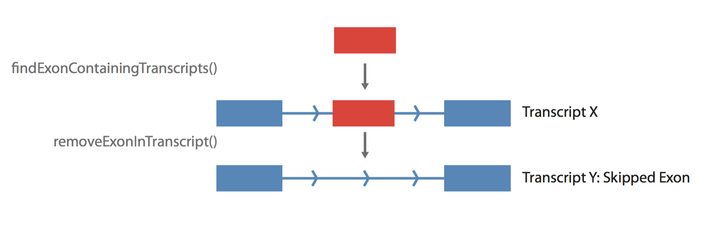
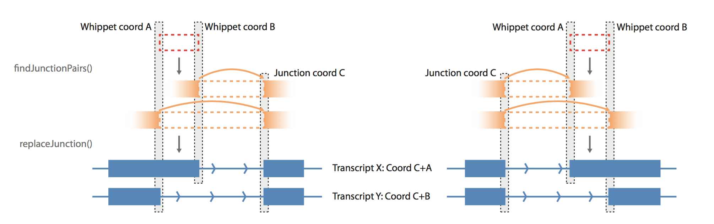
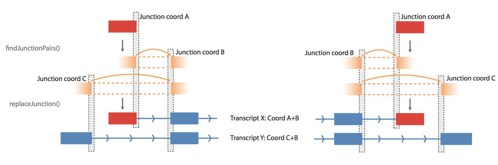
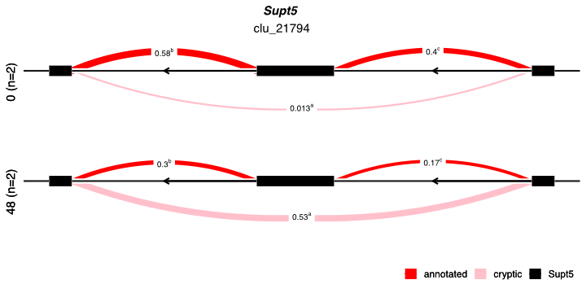
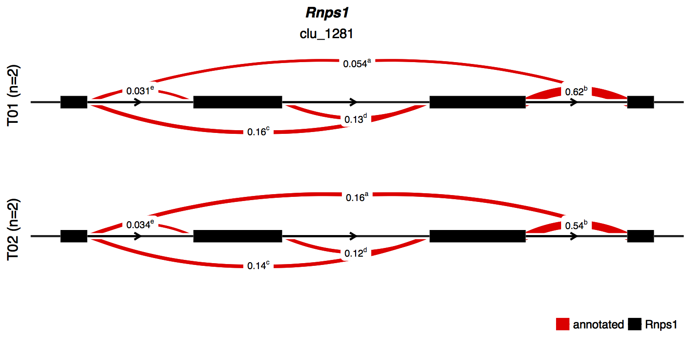

```{r setup, include=FALSE, echo=FALSE,cache=FALSE}
knitr::opts_chunk$set(echo=TRUE,
                      tidy=FALSE,
                      warning=FALSE,
                      message=FALSE)
```


# Introduction

GeneStructureTools is a package for the manipulation and analysis of transcribed gene structures.

We have provided functions for importing Whippet, leafcutter, rMATS, and IRFinder alternative splicing data, and the analysis of these splicing events. 
Splicing events can also be defined manually if you are using a different splicing analysis tool to Whippet.
For specific events - currently including exon skipping, intron retention, alternative splice site usage and alternative first/last exons - transcripts can be made in silico which use the two splicing modes - i.e. transcripts containing and transcripts skipping an exon. 
These transcripts do not have to be pre-annotated, and thus all potential isoforms can be compared for an event.

Current comparisons of transcripts include annotating and analysing ORF and UTR features (length, locations, difference/similarity between transcripts), and predicting nonsense mediated decay (NMD) potential.

Currently, very few available tools output splicing event type information (i.e. exon skipping, intron retention) within tested genes.
GeneStructureTools currently has functions for processing data from:

[**whippet**](https://github.com/timbitz/Whippet.jl)

[**rMATS turbo 4.0**](https://github.com/Xinglab/rmats-turbo)

[**IRFinder**](https://github.com/williamritchie/IRFinder)

[**leafcutter**](https://github.com/davidaknowles/leafcutter)


**Data Preparation**

We have pre-prepared data from mouse embryonic stem cell (ESC) development (Gloss et. al, 2017, Accession Number [GSE75028](https://www.ebi.ac.uk/ena/data/view/PRJNA302257)), at days 0 (0 hours) and 2 (48 hours), and run whippet on each replicate using the recommended parameters and the Gencode vM25 annotation.

You will also need to download the Gencode GTF file from [here](http://www.gencodegenes.org/mouse_releases/25.html).

For the purposes of this vignette, small subsets of these data are available in the package data (inst/extdata).

Data provided is typical output for leafcutter, Whippet, rMATS, and IRFinder. For details on what each file contains, please refer to their respective manuals ( [leafcutter](http://davidaknowles.github.io/leafcutter/index.html) | [Whippet](https://github.com/timbitz/Whippet.jl) | [rMATS](https://github.com/Xinglab/rmats-turbo) | [IRFinder](https://github.com/williamritchie/IRFinder)).

## Setup

```{r loadSetup, eval=TRUE}
# Load packages
library(GenomicRanges)
library(stringr)
library(BSgenome.Mmusculus.UCSC.mm10)
library(Gviz)
library(rtracklayer)
library(GeneStructureTools)

# read in gtf annotation
gtf <- rtracklayer::import(system.file("extdata","gencode.vM25.small.gtf", 
                                       package="GeneStructureTools"))
# format exons for use with GeneStructureTools
exons <- gtf[gtf$type == "exon"]
exons <- reformatExons(exons)

# specify the BSGenome annotation
g <- BSgenome.Mmusculus.UCSC.mm10::BSgenome.Mmusculus.UCSC.mm10

```


# Whippet

To run a full analysis on Whippet output, you will need the raw .psi.gz (percent spliced in) and .jnc.gz (junction read counts) files for each sample. In addition, you will need to compare conditions using `whippet-delta.jl` and have a resulting .diff.gz file.

## Quick analysis

**Read in Whippet files from package data**

```{r readWhippet}

# list of files in the whippet directory
whippet_file_directory <- system.file("extdata","whippet_small/", 
                                      package="GeneStructureTools")

# read in files as a whippetDataSet
wds.all <- readWhippetDataSet(whippet_file_directory)

# create a sample table with sample id, condition and replicate
whippet_sampleTable <- data.frame(sample=c("A_000_whippet","B_000_whippet",
                                           "A_048_whippet","B_048_whippet"),
                                  condition=c("00","00","48","48"),
                                  replicate=(c("A","B","A","B")))

```

**Summarise changes in gene structures due to splicing**
```{r filterWhippetEvents}
# filter events for significance
wds.significant <- filterWhippetEvents(
    whippetDataSet=wds.all,
    probability=0.8, # min probability
    psiDelta=0.1, # min change in PSI
    eventTypes="all", # all event types
    minCounts=10, #min number of counts in one condition
    sampleTable=whippet_sampleTable)

# check for changes in gene/transcript structure
whippet_summary <- whippetTranscriptChangeSummary(wds.significant,
                                                  unfilteredWDS=wds.all,
                                                  exons=exons,
                                                  BSgenome=g,
                                                  NMD=TRUE)

head(whippet_summary)

```


# leafcutter
## Quick analysis

**Pre-prepare leafcutter output**

Only the file containing the leafcutter results for each intron, and the .gtf file used with leafcutter needs to be read in for results processing. The leafcutter results file is generated after running [prepare_results.R](https://github.com/davidaknowles/leafcutter/blob/master/leafviz/prepare_results.R) on your data, then extracting out the intron data table.
We ran leafcutter on our samples using the following code to get a leafviz.RData file:
```{sh, leafcutterPrep, eval=FALSE}
leafviz/gtf2leafcutter.pl -o gencode.vM25 gencode.vM25.annotation.gtf
scripts/leafcutter_ds.R \
--num_threads 4 \
00_v_48_perind_numers.counts.gz \
groups_file.txt \
-i 2 -s 10 -g 1 \
-e gencode.vM25_all_exons.txt.gz

leafviz/prepare_results.R 00_v_48_perind_numers.counts.gz \
leafcutter_ds_cluster_significance.txt \
leafcutter_ds_effect_sizes.txt \
gencode.vM25 \
-m groups_file.txt
```

First, find the location of the leafviz2table.R script:
```{r, findScript, eval=FALSE}
#find location of the script
system.file("extdata","leafviz2table.R", package="GeneStructureTools")
```
Then run it on your leafviz output .RData file.
The first argument is the leafviz output .RData file, and the second is the name of the table you wish to write the intron results to.
```{sh, leafcutter2table, eval=FALSE}
Rscript leafviz2table.R leafviz.RData per_intron_results.tab
```

We have an processed example file available in `extdata/GeneStructureTools` with a small sample of significant events.

**Read in leafcutter files**

```{r readLeafcutter}
# list of files in the leafcutter directory
leafcutter_files <- list.files(system.file("extdata","leaf_small/", 
                                           package="GeneStructureTools"), 
                               full.names=TRUE, pattern="per_intron_results")
# read in as data.frame
intron_results <- read.delim(leafcutter_files, stringsAsFactors=FALSE)

```

**Summarise changes in gene structures due to splicing**
Leafcutter results files can be filtered manually prior to this step, otherwise leafcutterTranscriptChangeSummary() allows filtering by FDR. We highly recommend this step as leafcutter modeling is not straightforward and thus can take a very long time. We also include the ability to display a progressBar to estimate run times.
```{r leafcutterSummary}
# check for changes in gene/transcript structure
leafcutter_summary <- leafcutterTranscriptChangeSummary(intron_results, 
                                                        FDR=0.05, 
                                                        exons=exons,
                                                        BSgenome=g,
                                                        NMD=TRUE,
                                                        showProgressBar=FALSE)

head(leafcutter_summary[!duplicated(leafcutter_summary$cluster),])
```


# rMATS turbo 4.0
## Quick analysis
In the rMATS turbo output folder, there are two versions of the final output: [AS_Event].MATS.JC.txt and [AS_Event].MATS.JCEC.txt. "JC" uses reads that span junctions, whereas "JCEC" uses both reads spanning junctions and within exons. These will have different final results in terms of FDR and change is PSI, and only one type can be processed at a time by GeneStructureTools. By default this is "JC"

**Read in rMATS files**
```{r readRmats}
# get the rMATS results directory
rmats_dir <- system.file("extdata","rmats_small/", package="GeneStructureTools")

# read in the rMATs results
rds <- readRmatsDataSet(rmats_dir, type="JC")

```


**Summarise changes in gene structures due to splicing**
```{r rmatsSummary}
# filter for significance
rds.filtered <- filterRmatsEvents(rds, FDR=1e-4, psiDelta=0.1)

# check for changes in gene/transcript structure
rmats_summary <- rmatsTranscriptChangeSummary(rmatsDataSet=rds.filtered, 
                                              exons=exons, BSgenome=g)
head(rmats_summary)

```


# IRFinder 
## Quick analysis
Following differential IR analysis, you should get a file comparing intron retention in two conditions. We will use this as the input for IRFinder modeling. 

**Read in IRFinder files**
```{r readIRFinder}
# list IRFinder file
irfinder_file <- list.files(system.file("extdata","irf_small/", 
                                         package="GeneStructureTools"), 
                             full.names=TRUE)

# read in differential intron retention file
irf <- readIrfDataSet(irfinder_file)

```


**Summarise changes in gene structures due to splicing**
```{r irfinderSummary}
# filter for significance
irf.filtered <- filterIrfEvents(irf, FDR=0.01, psiDelta=0.3)
# check for changes in gene/transcript structure
irf_summary <- irfTranscriptChangeSummary(irf.filtered, exons=exons, BSgenome=g)
head(irf_summary)

```

# Altering gene and transcript structures
whippetTranscriptChangeSummary() and rmatsTranscriptChangeSummary() combine several functions for analysing changes in gene structures. While this has been made to simplify analysis from the output of these tools, individual functions can be used on other data sources or manually annotated gene structures.
It may also be helpful to run each individual step if you would like to manually investigate changes to genes. 

## Exon skipping and mutually exlusive exons
### Whippet
Exon skipping, or cassette exon usage, occurs when a single exon is spliced out of the mature transcript.
For the whippet version of this method, only the coordinates for the skipped exon are used. 
If you have coordinates for the upstream and downstream exons, please use the rMATS version (below).



**1.a. Find skipped exon events**
```{r whippetSkippedFilter}
# filter out skipped exon events (coded as "CE")
# we will be looking at Pam16 (ENSMUSG00000014301.13)
wds.ce <- filterWhippetEvents(wds.all, psiDelta=0.2,probability=0.99, 
event="CE", idList="ENSMUSG00000014301.13")

diffSplicingResults(wds.ce)
# psi_a=0.96 psi_b=0.68
# percentage of transcripts skipping exon increases from 0h to 48h

# whippet outputs the skipped exon coordinates
coordinates(wds.ce)

```

**2. Find transcripts which overlap the skipped exon, and create normal & skipped exon isoforms**
```{r findOverlapsSkipped}
# find exons in the gtf that overlap the skipped exon event
exons.ce <- findExonContainingTranscripts(wds.ce, exons)
# make skipped and included exon transcripts
# removes the skipped exon from all transcripts which contain it
skippedExonTranscripts <- skipExonInTranscript(skippedExons=exons.ce,
                                               exons=exons, 
                                               match="skip",
                                               whippetDataSet=wds.ce)

## make Gviz models
# set up for visualisation
gtr <- GenomeAxisTrack()

# all transcripts for the gene
geneModelAll <- GeneRegionTrack(makeGeneModel(exons[exons$gene_id  == 
skippedExonTranscripts$gene_id[1]]),
                                 name="Reference Gene",
                                 showId=TRUE,
                                 transcriptAnnotation="transcript")
# reference transcript
geneModelNormal <- GeneRegionTrack(makeGeneModel(
skippedExonTranscripts[skippedExonTranscripts$set == "included_exon"]),
                                   name="Reference Isoform",
                                   showId=TRUE, fill="#4D7ABE",
                                   transcriptAnnotation="transcript")
# for the skipped exon transcript
geneModelSkipped <- GeneRegionTrack(makeGeneModel(
skippedExonTranscripts[skippedExonTranscripts$set == "skipped_exon"]),
                                   name="Alternative Isoform",
                                   showId=TRUE, fill="#94AFD8",
                                   transcriptAnnotation="transcript")

plotTracks(list(gtr, geneModelAll, geneModelNormal, geneModelSkipped), 
           extend.left=1000, extend.right=1000)
# Only the transcript isoform containing the skipped exon (exon 2) 
# is used for analysis, and a 'novel' isoform is created by exon skipping

```

### rMATS
In contrast to whippet, rMATS output files directly specify the coordinates for the upstream and downstream exons (i.e the flanking junctions for the alternatively skipped exon). 
Due to this, we use a different method to identify transcripts containing the event, and subsequently model skipping or mutually exclusive exon usage.

#### Exon Skipping
```{r rmatsSkipped}
# filter out skipped exon events (coded as "SE")
# we will be looking at Lsr (ENSMUSG00000001247.16)
rmats.signif <- filterRmatsEvents(rds, FDR=0.05, psiDelta=0.1, minCounts=10, 
                                  idList="ENSMUSG00000001247.16")

diffSplice.SE.signif <- extractEvent(rmats.signif, "SE")

isoforms.SE <- skipExonByJunction(diffSplice.SE.signif, 
                                  eventType="SE", exons=exons)

## make Gviz models
# set up for visualisation
gtr <- GenomeAxisTrack()

# all transcripts for the gene
geneModelAll <- GeneRegionTrack(makeGeneModel(exons[exons$gene_id  == 
                                isoforms.SE$gene_id[1]]),
                                name="Reference Gene",
                                showId=TRUE,
                                transcriptAnnotation="transcript")
# non-skipped transcript
geneModelNormal <- GeneRegionTrack(makeGeneModel(
    isoforms.SE[isoforms.SE$set == "included_exon" & 
                isoforms.SE$gene_id == isoforms.SE$gene_id[1]]),
    name="Reference Isoform", showId=TRUE, fill="#4D7ABE",
    transcriptAnnotation="transcript")

# for the skipped exon transcript
geneModelSkipped <- GeneRegionTrack(makeGeneModel(
    isoforms.SE[isoforms.SE$set == "skipped_exon" & 
                isoforms.SE$gene_id == isoforms.SE$gene_id[1]]),
    name="Alternative Isoform", showId=TRUE, fill="#94AFD8",
    transcriptAnnotation="transcript")

plotTracks(list(gtr, geneModelAll, geneModelNormal, geneModelSkipped), 
           extend.left=1000, extend.right=1000)

```

#### Mutually exclusive exons

```{r rmatsMutuallyExclusive}
# filter out skipped exon events (coded as "MXE")
# we will be looking at Lsr (ENSMUSG00000001247.16)
rmats.signif <- filterRmatsEvents(rds, FDR=0.05, psiDelta=0.1, minCounts=10, 
                                  idList="ENSMUSG00000001247.16")

diffSplice.MXE.signif <- extractEvent(rmats.signif, "MXE")


isoforms.MXE <- skipExonByJunction(diffSplice.MXE.signif, 
                                   eventType="MXE", exons=exons)

## make Gviz models
# Set up for visualisation
gtr <- GenomeAxisTrack()

# all transcripts for the gene
geneModelAll <- GeneRegionTrack(makeGeneModel(
    exons[exons$gene_id == diffSplice.MXE.signif$GeneID[1]]),
    name="Reference Gene", showId=TRUE,
    transcriptAnnotation="transcript")
# transcripts containing exon 1 (and not 2)
geneModel1 <- GeneRegionTrack(makeGeneModel(
    isoforms.MXE[isoforms.MXE$set == "included_exon1"]),
    name="Reference Isoform", showId=TRUE, fill="#4D7ABE",
    transcriptAnnotation="transcript")
# transcripts containing exon 2 (and not 1)
geneModel2 <- GeneRegionTrack(makeGeneModel(
    isoforms.MXE[isoforms.MXE$set == "included_exon2"]),
    name="Alternative Isoform", showId=TRUE, fill="#94AFD8",
    transcriptAnnotation="transcript")

plotTracks(list(gtr, geneModelAll, geneModel1, geneModel2), 
           extend.left=1000, extend.right=1000)


```

## Intron Retention
Intron Retention occurs when an intron is not spliced out of the mature transcript.
Note that we use 1-based coordinates for all events - including intron retention. 

### Whippet


**1. Create normal and retained isoform structures from whippet coordinates**
```{r retainedIntronWhippet}
# filter out retained events (coded as "RI")
# we will be looking at Tmem258 (ENSMUSG00000036372.14)
wds.ri <- filterWhippetEvents(wds.all, psiDelta=0.2,probability=0.99, 
                              event="RI", idList="ENSMUSG00000036372.14")

diffSplicingResults(wds.ri)

```


**2. Find transcripts which overlap the intron, and create normal & retained intron isoforms**
```{r findIntron}
# find exons pairs in the gtf that bound the retained intron event
exons.ri <- findIntronContainingTranscripts(wds.ri, 
                                            exons)

# make retained and non-retained transcripts
# adds the intron into all transcripts which overlap it
retainedIntronTranscripts <- addIntronInTranscript(exons.ri, 
                                                   exons=exons, 
                                                   whippetDataSet=wds.ri,
                                                   glueExons=TRUE)

## make Gviz models
# all transcripts for the gene
geneModelAll <- GeneRegionTrack(
    makeGeneModel(exons[exons$gene_id == retainedIntronTranscripts$gene_id[1]]),
    name="Reference Gene", showId=TRUE, transcriptAnnotation="transcript")
# normal transcript - spliced out intron
geneModelNormal <- GeneRegionTrack(makeGeneModel(
    retainedIntronTranscripts[
        retainedIntronTranscripts$set == "spliced_intron"]),
    name="Reference Isoform", showId=TRUE, fill="#4D7ABE",
    transcriptAnnotation="transcript")
# for the retained intron transcript
geneModelRetained <- GeneRegionTrack(makeGeneModel(
    retainedIntronTranscripts[
        retainedIntronTranscripts$set == "retained_intron"]),
    name="Alternative Isoform", showId=TRUE, fill="#94AFD8",
    transcriptAnnotation="transcript")

# Only the transcript isoforms with exons at the boundaries of the retained 
# intron are used for analysis, and 'novel' isoforms are created by intron 
# retention
plotTracks(list(gtr, geneModelAll, geneModelNormal, geneModelRetained), 
           extend.left=1000, extend.right=1000)
```

### rMATS
The rMATS version of intron retention uses the same internal functions for inserting/removing introns, as - by design - intron retention coordinates contain the up/downstream 'junctions' 

```{r rmatsRetainedIntron}
# filter out skipped exon events (coded as "RI")
# we will be looking at Bcas2 (ENSMUSG00000005687.14)
rmats.signif <- filterRmatsEvents(rds, FDR=0.05, psiDelta=0.1, minCounts=10, 
                                  idList="ENSMUSG00000005687.14")

diffSplice.RI.signif <- extractEvent(rmats.signif, "RI")

isoforms.RI <- altIntronRmats(diffSplice.RI.signif,  exons=exons)

## make Gviz models
# Set up for visualisation
gtr <- GenomeAxisTrack()

# all transcripts for the gene
geneModelAll <- GeneRegionTrack(makeGeneModel(
    exons[exons$gene_id == diffSplice.RI.signif$GeneID[1]]),
    name="Reference Gene", showId=TRUE, transcriptAnnotation="transcript")
# normal transcript - spliced out intron
geneModelSkipped <- GeneRegionTrack(makeGeneModel(
    isoforms.RI[isoforms.RI$set == "spliced_intron" & 
                isoforms.RI$gene_id == diffSplice.RI.signif$GeneID[1]]),
    name="Reference Isoform", showId=TRUE, fill="#4D7ABE",
    transcriptAnnotation="transcript")
# for the skipped exon transcript
geneModelRetained <- GeneRegionTrack(makeGeneModel(
    isoforms.RI[isoforms.RI$set == "retained_intron" & 
                isoforms.RI$gene_id == diffSplice.RI.signif$GeneID[1]]),
    name="Alternative Isoform", showId=TRUE, fill="#94AFD8",
    transcriptAnnotation="transcript")

plotTracks(list(gtr, geneModelAll, geneModelSkipped, geneModelRetained), 
           extend.left=1000, extend.right=1000)

```

## Alternative acceptor and donor splice sites
### Whippet
Creation of alternative donor/acceptor isoforms currently relies on junction read counts supplied by whippet.



#### Aternative acceptor

**1. Create normal and alternative isoform structures from whippet coordinates**
```{r whippetAltAccept}
# filter out alternative acceptor events (coded as "AA")
wds.aa <- filterWhippetEvents(wds.all, psiDelta=0.2,probability=0.9, 
                              event="AA", idList="ENSMUSG00000014873.15")

diffSplicingResults(wds.aa)

# AA/AD coordinates range from the normal acceptor splice site to the 
# alternative acceptor splice site
coordinates(wds.aa)
```


```{r whippetFindJunctionsAA}
# find exons pairs in the gtf that bound the retained intron event
junctionPairs.aa <- findJunctionPairs(wds.aa, type="AA")
junctionPairs.aa
```

```{r whippetReplaceJunctionAA}
# make transcripts with alternative junction usage
altTranscripts <- replaceJunction(wds.aa, junctionPairs.aa, exons, type="AA")

# make transcripts using junction X
xTranscripts <- altTranscripts[altTranscripts$set == "AA_X"]
# make transcripts using junction Y
yTranscripts <- altTranscripts[altTranscripts$set == "AA_Y"]
```

```{r WhippetAltAceGvis}
geneModelAll <- GeneRegionTrack(makeGeneModel(
    exons[exons$gene_id == altTranscripts$gene_id[1]]),
    name="Reference Gene", showId=TRUE, transcriptAnnotation="transcript")
# transcript X
geneModelX <- GeneRegionTrack(makeGeneModel(xTranscripts),
                              name="Isoform X", showId=TRUE, fill="#4D7ABE",
                              transcriptAnnotation="transcript")
# transcript Y
geneModelY<- GeneRegionTrack(makeGeneModel(yTranscripts),
                             name="Isoform Y", showId=TRUE, fill="#94AFD8",
                             transcriptAnnotation="transcript")

plotTracks(list(gtr, geneModelAll, geneModelX, geneModelY), 
           extend.left=1000, extend.right=1000)


```

#### Aternative donor

**1. Create normal and alternative isoform structures from whippet coordinates**
```{r WhippetAltDonor}
# filter out alternative acceptor events (coded as "AD")
wds.ad <- filterWhippetEvents(wds.all, psiDelta=0.1, probability=0.9, 
                              event="AD", idList="ENSMUSG00000025135.12")

diffSplicingResults(wds.ad)
# AD coordinates range from the normal donor splice site to the 
# alternative donor splice site
coordinates(wds.ad)
```


```{r WhippetcreateIsoformsAD}
# find exons pairs in the gtf that bound the retained intron event
junctionPairs.ad <- findJunctionPairs(wds.ad, type="AD")

# make transcripts with alternative junction usage
altTranscripts <- replaceJunction(wds.ad, junctionPairs.ad, exons, type="AD")

# make transcripts using junction X
xTranscripts <- altTranscripts[altTranscripts$set == "AD_X"]
# make transcripts using junction Y
yTranscripts <- altTranscripts[altTranscripts$set == "AD_Y"]
```

```{r WhippetAltDonGvis}
geneModelAll <- GeneRegionTrack(makeGeneModel(
    exons[exons$gene_id == altTranscripts$gene_id[1]]),
    name="Reference Gene", showId=TRUE, transcriptAnnotation="transcript")
# transcript X
geneModelX <- GeneRegionTrack(makeGeneModel(xTranscripts),
                              name="Isoform X", showId=TRUE, fill="#4D7ABE",
                              transcriptAnnotation="transcript")
# transcript Y
geneModelY <- GeneRegionTrack(makeGeneModel(yTranscripts),
                             name="Isoform Y", showId=TRUE, fill="#94AFD8",
                             transcriptAnnotation="transcript")

plotTracks(list(gtr, geneModelAll, geneModelX, geneModelY), 
           extend.left=1000, extend.right=1000)

```

### rMATS
rMATS encodes alternative donor and acceptor events as alternative 5' (A5SS) and alternative 3' (A3SS) events respectively. 
As up/downstream exon coordinates are given, we do not need to search through junction counts for these.
#### Alternative Acceptor / Alt 3'SS
```{r rmatsAltAcceptor}
# filter out alternative acceptor events (coded as "A3SS")
# we will be looking at Rsrp1 (ENSMUSG00000037266.18)
rmats.signif <- filterRmatsEvents(rds, FDR=0.05, psiDelta=0.1, minCounts=10, 
                                  idList="ENSMUSG00000037266.18")
diffSplice.A3SS.signif <- extractEvent(rmats.signif, "A3SS")

isoforms.A3SS <- altSpliceSiteRmats(diffSplice.A3SS.signif, 
                                    eventType="A3SS", exons=exons)

## make Gviz models
# Set up for visualisation
gtr <- GenomeAxisTrack()

# all transcripts for the gene
geneModelAll <- GeneRegionTrack(makeGeneModel(
    exons[exons$gene_id == diffSplice.A3SS.signif$GeneID[1]]),
    name="Reference Gene", showId=TRUE,
    transcriptAnnotation="transcript")
# transcript with shorter exon version
geneModelShort <- GeneRegionTrack(makeGeneModel(
    isoforms.A3SS[isoforms.A3SS$set == "alt3_splicesite_short"]),
    name="Reference Isoform", showId=TRUE, fill="#4D7ABE",
    transcriptAnnotation="transcript")
# transcript with longer exon version
geneModelLong <- GeneRegionTrack(makeGeneModel(
    isoforms.A3SS[isoforms.A3SS$set == "alt3_splicesite_long"]),
    name="Alternative Isoform", showId=TRUE, fill="#94AFD8",
    transcriptAnnotation="transcript")

plotTracks(list(gtr, geneModelAll, geneModelShort, geneModelLong), 
           extend.left=1000, extend.right=1000)


```


#### Alternative Donor/ Alt 5'SS
```{r rmatsAltDonor}
# filter out alternative donor (coded as "A5SS")
# we will be looking at Metrn (ENSMUSG00000002274.13)

rmats.signif <- filterRmatsEvents(rds, FDR=0.05, psiDelta=0.1, minCounts=10, 
                                  idList="ENSMUSG00000002274.13")
diffSplice.A5SS.signif <- extractEvent(rmats.signif, "A5SS")

isoforms.A5SS <- altSpliceSiteRmats(diffSplice.A5SS.signif, 
                                    eventType="A5SS", exons=exons)

## make Gviz models
# Set up for visualisation
gtr <- GenomeAxisTrack()

# all transcripts for the gene
geneModelAll <- GeneRegionTrack(makeGeneModel(
    exons[exons$gene_id == diffSplice.A5SS.signif$GeneID[1]]),
    name="Reference Gene", showId=TRUE, transcriptAnnotation="transcript")
# transcript with shorter exon version
geneModelShort <- GeneRegionTrack(makeGeneModel(
    isoforms.A5SS[isoforms.A5SS$set == "alt5_splicesite_short"]),
    name="Reference Isoform", showId=TRUE, fill="#4D7ABE",
    transcriptAnnotation="transcript")
# transcript with longer exon version
geneModelLong <- GeneRegionTrack(makeGeneModel(
    isoforms.A5SS[isoforms.A5SS$set == "alt5_splicesite_long"]),
    name="Alternative Isoform", showId=TRUE, fill="#94AFD8",
    transcriptAnnotation="transcript")

plotTracks(list(gtr, geneModelAll, geneModelShort, geneModelLong), 
           extend.left=1000, extend.right=1000)


```

## Alternative first/last exons
Creation of alternative first/last isoforms currently relies on junction read counts supplied by whippet. 



#### Alternative first exons

**1. Create normal and alternative isoform structures from whippet coordinates**
```{r WhippetAltFirst}
# filter out alternative first exon events (coded as "AF")
wds.af <- filterWhippetEvents(wds.all, psiDelta=0.2,probability=0.8, 
                              event="AF", idList="ENSMUSG00000027239.14")

diffSplicingResults(wds.af)

# whippet outputs first (or last) exon being tested only
# AF/AL coordinates range are exon coordinates for the tested first/last exon
coordinates(wds.af)
```


```{r WhippetCreateIsoformsAF}
# find junction pairs that use the same acceptor/donor as the specified first/last exon
# i.e. find the alternative first/last exon
junctionPairs.af <- findJunctionPairs(wds.af, type="AF")
junctionPairs.af
```


```{r WhiippetReplaceJunctionAF}
# make transcripts with alternative junction usage
altTranscripts <- replaceJunction(wds.af, junctionPairs.af, 
                                  exons, type="AF")

# make transcripts using exon X
xTranscripts <- altTranscripts[altTranscripts$set == "AF_X"]
# make transcripts using exon Y
yTranscripts <- altTranscripts[altTranscripts$set == "AF_Y"]

geneModelAll <- GeneRegionTrack(makeGeneModel(
    exons[exons$gene_id == altTranscripts$gene_id[1]]),
    name="Reference Gene", showId=TRUE, transcriptAnnotation="transcript")
# X isoforms (shorter intron)
geneModelX <- GeneRegionTrack(makeGeneModel(xTranscripts),
                              name="Isoform X",
                              showId=TRUE, fill="#4D7ABE",
                              transcriptAnnotation="transcript")
# Y isoforms (longer intron)
geneModelY<- GeneRegionTrack(makeGeneModel(yTranscripts),
                             name="Isoform Y",
                             showId=TRUE, fill="#94AFD8",
                             transcriptAnnotation="transcript")

plotTracks(list(gtr, geneModelAll ,geneModelX, geneModelY), 
           extend.left=1000, extend.right=1000)
```

#### Alternative last exons

**1. Create normal and alternative isoform structures from whippet coordinates**
```{r WhippetAltLast}
# filter out alternative last exon events (coded as "AL")
wds.al <- filterWhippetEvents(wds.all, psiDelta=0.1,probability=0.9, 
                              event="AL", idList="ENSMUSG00000025289.15")

diffSplicingResults(wds.al)

# whippet outputs first (or last) exon being tested only
# AF/AL coordinates range are exon coordinates for the tested first/last exon
coordinates(wds.al)
```


```{r createIsoformsAL}
# find junction pairs that use the same acceptor/donor as the specified 
# first/last exon
# i.e. find the alternative first/last exon
junctionPairs.al <- findJunctionPairs(wds.al, type="AL")
junctionPairs.al

```

```{r whippetReplaceJunctionAL}
# make transcripts with alternative junction usage
altTranscripts <- replaceJunction(wds.al, junctionPairs.al, 
                                  exons, 
                                  type="AL")

# make transcripts using junction X
xTranscripts <- altTranscripts[altTranscripts$set == "AL_X"]
# make transcripts using junction Y
yTranscripts <- altTranscripts[altTranscripts$set == "AL_Y"]

geneModelAll <- GeneRegionTrack(makeGeneModel(
    exons[exons$gene_id == altTranscripts$gene_id[1]]),
    name="Reference Gene", showId=TRUE, transcriptAnnotation="transcript")
# X isoforms (shorter intron)
geneModelX <- GeneRegionTrack(makeGeneModel(xTranscripts),
                              name="Isoform X",
                              showId=TRUE, fill="#4D7ABE",
                              transcriptAnnotation="transcript")
# Y isoforms (longer intron)
geneModelY<- GeneRegionTrack(makeGeneModel(yTranscripts),
                             name="Isoform Y",
                             showId=TRUE, fill="#94AFD8",
                             transcriptAnnotation="transcript")

plotTracks(list(gtr, geneModelAll, geneModelX, geneModelY), 
           extend.left=1000, extend.right=1000)
```

## Alternative transcript start sites/end sites
Creation of alternative transcript start sites/end sites currently only works on whippet coordinates. 
In contrast to other whippet events, whippet coordinates for alternative TS/TE correspond to one part of an entire first/last exon. As such, even if only one event is filtered as 'significant', we still need to group this event with the others in the same 'group' to generate an upregulated and a downregulated isoform. This means that an unfiltered whippetDataSet must also be provided along with the filtered version.
Furthermore, if multiple significant events occur in the same group, we pair the two with the greatest delta PSI. 
As these are strictly not alternative splicing events as the junctions stay the same, and given the large number of 'significant' events we do not recommend analysing these events, but the code is nonetheless available if you wish to do so. If you wish to exclude these events from the `whippetTranscriptChangeSummary` function, you can specify `eventTypes` as `c('CE', 'RI', 'AF', 'AL', 'AA', 'AD')` which will skip TS/TE. 

```{r WhippetCreateIsoformsTS}
# filter events
wds.altTS <- filterWhippetEvents(wds.all, eventTypes="TS", probability=0.99, 
                                 psiDelta=0.4, idList="ENSMUSG00000004951.10")
diffSplicingResults(wds.altTS)

# find junction pairs that use the same acceptor/donor as the specified 
# first/last exon
# replace starts/ends
transcripts.altTS <- alterTranscriptStartEnds(wds.altTS, exons, 
                                              unfilteredWDS=wds.all, type="TS")

# make transcripts using upregulated TSS
upregTranscripts <- 
    transcripts.altTS[transcripts.altTS$set == "tss_upregulated"]
# make transcripts using downregulated TSS
downregTranscripts <- 
    transcripts.altTS[transcripts.altTS$set == "tss_downregulated"]

geneModelAll <- GeneRegionTrack(makeGeneModel(
    exons[exons$gene_id == upregTranscripts$gene_id[1]]),
    name="Reference Gene",
    showId=TRUE, transcriptAnnotation="transcript")
# upregulated isoforms
geneModelUpreg <- GeneRegionTrack(makeGeneModel(upregTranscripts),
                                  name="Upregulated Isoforms",
                                  showId=TRUE, fill="#4D7ABE",
                                  transcriptAnnotation="transcript")
# downregulated isoforms
geneModelDownreg <- GeneRegionTrack(makeGeneModel(downregTranscripts),
                                    name="Downregulated Isoforms",
                                    showId=TRUE, fill="#94AFD8",
                                    transcriptAnnotation="transcript")

plotTracks(list(gtr, geneModelAll, geneModelUpreg, geneModelDownreg), 
           extend.left=1000, extend.right=1000)

```


## Alternative Intron usage (leafcutter)
leafcutter uses an intron-centric view of splicing, and therefore all tested events are given as intron coordinates in clusters. Alternative isoforms are generated in sets. If possible, all downregulated introns/junctions are grouped together in a set, and all upregulated introns/junctions in another. 

alternativeIntronUsage() first finds transcripts which overlap each intron set, and have perfect matches to the start and end of the intron (i.e. share splice sites). If exons are present within the range overlapping the intron set, these are replaced with exons that preserve the intron usage set.

**Three intron cluster**



```{r leafcutterSupt5}
# select a single cluster
cluster <- leafcutter_summary[leafcutter_summary$cluster == "chr7:clu_21794",]

# generate alternative isoforms
altIsoforms21794 <- alternativeIntronUsage(cluster, exons)
# downregulated isoforms
altIsoforms21794_dnreg <- altIsoforms21794[grep("dnre", 
                                            altIsoforms21794$transcript_id)]
# upregulated isoforms
altIsoforms21794_upreg <- altIsoforms21794[grep("upre", 
                                            altIsoforms21794$transcript_id)]

# visualise
gtr <- GenomeAxisTrack()

geneModel.ref <- GeneRegionTrack(makeGeneModel(
    exons[exons$gene_id == "ENSMUSG00000003435.9"]),
    name="Reference Gene",
    showId=TRUE, transcriptAnnotation="transcript")

geneModel.dnreg <- GeneRegionTrack(makeGeneModel(altIsoforms21794_dnreg),
                                   name="Downregulated isoforms",
                                   showId=TRUE,fill="#4D7ABE",
                                   transcriptAnnotation="transcript")

geneModel.upreg <- GeneRegionTrack(makeGeneModel(altIsoforms21794_upreg),
                                name="Upregulated isoforms",
                                showId=TRUE, fill="#94AFD8",
                                transcriptAnnotation="transcript")

plotTracks(list(geneModel.ref, geneModel.dnreg, geneModel.upreg), 
           extend.left=1000, extend.right=1000)

```
**Five intron cluster**
More sets may be used if the number of introns in each cluster is greater than three.
In this case, the upregulated introns can overlap, so are split into two sets: b, and c+d



```{r leafcutterRnps1}
# select a single cluster
cluster <- leafcutter_summary[leafcutter_summary$cluster == "chr17:clu_20975",]

# generate alternative isoforms
altIsoforms20975 <- alternativeIntronUsage(cluster, exons)

# downregulated isoforms
altIsoforms20975_dnreg <- altIsoforms20975[grep("dnre", 
                                            altIsoforms20975$transcript_id)]
# upregulated isoforms
altIsoforms20975_upreg <- altIsoforms20975[grep("upre", 
                                            altIsoforms20975$transcript_id)]

# visualise
gtr <- GenomeAxisTrack()

geneModel.ref <- GeneRegionTrack(makeGeneModel(
    exons[exons$gene_id == altIsoforms20975$gene_id[1]]),
    name="Reference Gene",
    showId=TRUE, transcriptAnnotation="transcript")

geneModel.dnreg <- GeneRegionTrack(makeGeneModel(altIsoforms20975_dnreg),
                                   name="Downregulated isoforms",
                                   showId=TRUE, fill="#4D7ABE",
                                   transcriptAnnotation="transcript")

geneModel.upreg <- GeneRegionTrack(makeGeneModel(altIsoforms20975_upreg),
                                   name="Upregulated isoforms",
                                   showId=TRUE, fill="#94AFD8",
                                   transcriptAnnotation="transcript")

plotTracks(list(geneModel.ref, geneModel.dnreg, geneModel.upreg), 
           extend.left=1000, extend.right=1000)

```

# Annotate open reading frames

**1. Find open reading frame features**
```{r, SkippedExonORF}
# we will be looking at Ndufv3 (ENSMUSG00000024038.16) again
wds.ce <- filterWhippetEvents(wds.all, psiDelta=0.2,probability=0.99, 
event="CE", idList="ENSMUSG00000014301.13")

# find exons in the gtf that overlap the skipped exon event
exons.ce <- findExonContainingTranscripts(wds.ce, 
                                          exons=exons)
# make skipped and included exon transcripts
# removes the skipped exon from all transcripts which contain it
skippedExonTranscripts <- skipExonInTranscript(skippedExons=exons.ce,
                                               exons=exons, 
                                               match="exact",
                                               whippetDataSet=wds.ce)
# make non-skipped exon transcripts
normalTranscripts <- exons[exons$transcript_id %in% 
                               exons.ce$transcript_id]

# get ORF details for each set of transcripts
orfs_normal <- getOrfs(normalTranscripts, BSgenome=g, 
                       returnLongestOnly=FALSE, allFrames=TRUE)
orfs_skipped <- getOrfs(skippedExonTranscripts[skippedExonTranscripts$set == 
                                                                "skipped_exon"],
                        BSgenome=g,
                        returnLongestOnly=FALSE, allFrames=TRUE)
orfs_included <- getOrfs(skippedExonTranscripts[skippedExonTranscripts$set == 
                                                               "included_exon"],
                         BSgenome=g,
                        returnLongestOnly=FALSE, allFrames=TRUE)
head(orfs_normal[,-8])
# id: transcript isoform id
# gene_id: gene id
# frame: which open reading frame (1:3)
# seq_length: sequence length (in AA)
# seq_length_nt: sequence length (in nt)
# start_site: ORF start site (in AA)
# stop_site: ORF stop site (in AA)
# orf_sequence: ORF sequence (not shown)
# orf_length: ORF length (in AA)
# start_site_nt:  ORF start site (in nt) / 5'UTR length
# stop_site_nt:  ORF stop site (in nt)
# utr3_length: 3'UTR length (in nt)
# min_dist_to_junction_a: distance from stop codon to upstream junction (junction A) 
# exon_a_from_start: junction A exon number
# min_dist_to_junction_b: distance from stop codon to downstream junction (junction B), 
# exon_b_from_final: junction B exon number (counting backwards from the final exon)
```

We can also annotate upstream open reading frames for transcripts
```{r, upstreamORFs}
# either as an individual data.frame with all uORFs
upstreamORFs <- getUOrfs(normalTranscripts, BSgenome=g, 
                         orfs=orfs_normal, findExonB=TRUE)

head(upstreamORFs)
# id: transcript id
# frame: reading frame for ORIGINAL orf data
# overlaps_main_orf: is the entire uorf upstream of the main orf (upstream), or is there  some overlap with the main orf (downstream) - i.e. uORF stop codon is within the main ORF
# uorf_length: length of the uorf (in AA)
# start_site_nt: position (in nt) where the uorf start codon occurs within the transcript
# stop_site_nt: position (in nt) where the uorf stop codon occurs within the transcript
# dist_to_start_nt: distance (in nt) from the uorf stop codon to the main orf start codon
# min_dist_to_junction_b: distance from the uorf stop codon to the nearest downstream exon end/splice junction
# exon_b_from_final: relative exon number (from the end) of the uorf stop codon containing exon

# or as a summary by using the getOrfs() function
# with uORFS=TRUE
orfs_normal <- getOrfs(normalTranscripts, BSgenome=g, 
                       returnLongestOnly=FALSE, allFrames=TRUE,
                       uORFs=TRUE)

head(orfs_normal[,-8])
# this adds the following columns:
# total_uorfs: total number of uorfs found for the transcript and annotated open reading frame.
# upstream_count: number of uorfs that are located fully upstream of the main orf
# downstream_count: number of uorfs which partially overlap the main orf
# max_uorf: maximum length of an annotated uorf. If no uorfs annotated, = 0
# uorf_maxb: maximum distance from the uorf stop codon to the nearest downstream exon end/splice junction

```

**2. Compare ORFs**
```{r CompareORF}
# compare normal and skipped isoforms
orfChange <- orfDiff(orfsX=orfs_included, 
                     orfsY=orfs_skipped, 
                     filterNMD=FALSE,
                     compareBy="gene",
                     geneSimilarity=TRUE,
                     compareUTR=TRUE,
                     allORFs=orfs_normal)

orfChange
# id: splicing event ID
# orf_length_x: longest orf in first set of transcripts (included exon)
# orf_length_y: longest orf in second set of transcripts (skipped exon)
# utr3_length_x: 3'UTR length in first set of transcripts (included exon)
# utr3_length_y: 3'UTR length in second set of transcripts (skipped exon)
# utr5_length_x: 5'UTR length in first set of transcripts (included exon)
# utr5_length_y: 5'UTR length in second set of transcripts (skipped exon)
# filtered: filtered for NMD ?
# percent_orf_shared: percent of the ORF shared between skipped and included exon transcripts
# max_percent_orf_shared: theoretical maximum percent of the ORF that could be shared (orf_length_y / orf_length_x) or (orf_length_x / orf_length_y)
# orf_percent_kept_x: percent of the ORF in group x (included exon) contained in group y (skipped exon)
# orf_percent_kept_y: percent of the ORF in group y (skipped exon) contained in group x (included exon)
# gene_similarity_x: max percent of a normal ORF shared in the group x (included exon) transcript. If multiple ORF frames and transcripts are available, this is the maximum value from comparing the skipped isoform ORF to ALL normal isoform ORFs. 
# gene_similarity_y: max percent of a normal ORF shared in the group y (skipped exon) transcript. If multiple ORF frames and transcripts are available, this is the maximum value from comparing the skipped isoform ORF to ALL normal isoform ORFs. 
```

**2.b. Compare ORFs with NMD probability**

This adds an extra two columns to the orfChange output:

`nmd_prob_x`: minimum NMD probability in first set of transcripts (normalTranscripts)
`nmd_prob_y`: minimum NMD probability in second set of transcripts (skippedExonTranscripts)


```{r plotORFs, eval=TRUE}
# plot ORFs on transcripts
# annotate UTR/CDS locations
geneModel.skipped <- annotateGeneModel(skippedExonTranscripts[
    skippedExonTranscripts$set == "skipped_exon"], orfs_skipped)
geneModel.included <- annotateGeneModel(skippedExonTranscripts[
    skippedExonTranscripts$set == "included_exon"], orfs_included)

grtr.included <- GeneRegionTrack(geneModel.included,
                            name="Included Isoform",
                            showId=TRUE, fill="#4D7ABE",
                            transcriptAnnotation="transcript")
# make tracks for non-nmd targeted CDS
grtrCDS.included <- GeneRegionTrack(
    geneModel.included[geneModel.included$feature == "CDS",],
                                name="Included Isoform CDS",
                                showId=TRUE,fill="#CB3634", 
                                transcriptAnnotation="transcript")

grtr.skipped <- GeneRegionTrack(geneModel.skipped,
                            name="Skipped Isoform",
                            showId=TRUE, fill="#4D7ABE",
                            transcriptAnnotation="transcript")
# make tracks for non-nmd targeted CDS
grtrCDS.skipped <- GeneRegionTrack(
      geneModel.skipped[geneModel.skipped$feature == "CDS",],
                                name="Skipped Isoform CDS",
                                showId=TRUE,fill="#CB3634", 
                                transcriptAnnotation="transcript")
plotTracks(list(gtr, grtr.included, grtr.skipped, 
grtrCDS.included,grtrCDS.skipped), 
extend.left=1000, extend.right=1000)
# Full length transcripts in blue, CDS only in red
```

By using GeneStructureTools and examining visually, we find that skipping of exon 3 in Ndufv3 decreases the size open reading frame (from 468 to 104AA), by removing an in frame exon - UTR lengths are unchanged and no alternative ORF sequence is generated. 

```{r, RetainedORF}

rmats.signif <- filterRmatsEvents(rds,idList="Tmem208", psiDelta=0.2)
rmats.RI <- extractEvent(rmats.signif, "RI")

isoforms.RI <- altIntronRmats(rmats.RI, exons=exons)
orfChanges.RI <- transcriptChangeSummary(
    isoforms.RI[isoforms.RI$set == "spliced_intron"],
    isoforms.RI[isoforms.RI$set == "retained_intron"],
    BSgenome=g, NMD=TRUE, exportGTF=NULL, dataSet=rmats.signif)

m <- match(unlist(lapply(str_split(orfChanges.RI$id, "[-]"), "[[", 1)), 
           rmats.RI$ID)
orfChanges.RI.rmats <- cbind(rmats.RI[m, c('ID', 'GeneID', 'geneSymbol', 
                                          'PValue','FDR', 
                                          'IncLevelDifference')], 
                             type="RI", orfChanges.RI)

# plot ORFs on transcripts

# make non-retained intron transcripts
normalTranscripts <- exons[exons$transcript_id %in%
    unlist(lapply(str_split(isoforms.RI$transcript_id, "[+]"), "[[",1))]

# get ORF details for each set of transcripts
orfs_normal <- getOrfs(normalTranscripts, BSgenome=g, 
                       returnLongestOnly=FALSE, allFrames=TRUE)

orfs_retained <- getOrfs(isoforms.RI[isoforms.RI$set == "retained_intron"],
                        BSgenome=g, returnLongestOnly=TRUE, allFrames=TRUE)

orfs_spliced <- getOrfs(isoforms.RI[isoforms.RI$set == "spliced_intron"],
                        BSgenome=g, returnLongestOnly=TRUE, allFrames=TRUE)


# annotate UTR/CDS locations
geneModel.retained <- annotateGeneModel(
    isoforms.RI[isoforms.RI$set == "retained_intron"], orfs_retained)
geneModel.spliced <- annotateGeneModel(
    isoforms.RI[isoforms.RI$set == "spliced_intron"], orfs_spliced)


grtr.spliced <- GeneRegionTrack(geneModel.spliced,
                                name="Spliced Isoform",
                                showId=TRUE, fill="#4D7ABE", 
                                transcriptAnnotation="transcript")
grtrCDS.spliced <- GeneRegionTrack(
    geneModel.spliced[geneModel.spliced$feature == "CDS",],
    name="Spliced Isoform CDS",
    showId=TRUE,fill="#CB3634", transcriptAnnotation="transcript")

grtr.retained <- GeneRegionTrack(geneModel.retained,
                                 name="Retained Isoform",
                                 showId=TRUE, fill="#4D7ABE", 
                                 transcriptAnnotation="transcript")
grtrCDS.retained <- GeneRegionTrack(
    geneModel.retained[geneModel.retained$feature == "CDS",],
    name="Retained Isoform CDS",
    showId=TRUE,fill="#CB3634", transcriptAnnotation="transcript")

gtr <- GenomeAxisTrack()
plotTracks(list(gtr, grtr.spliced, grtrCDS.spliced, 
                grtr.retained, grtrCDS.retained), 
           extend.left=1000, extend.right=1000)

# Full length transcripts in blue, CDS only in red

```

By using GeneStructureTools and examining visually, we find that intron retention in Srsf1 decreases the size open reading frame (from 253 to 201AA), by generating a premature stop codon. 


# Session Info
```{r SessionInfo}
sessionInfo()
```
